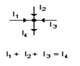
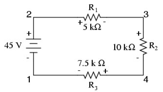
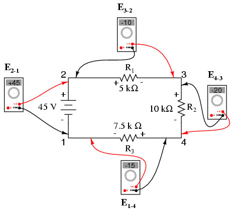
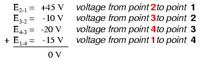
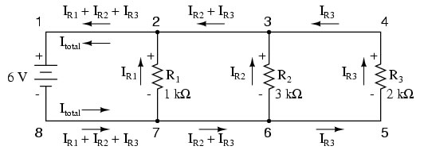
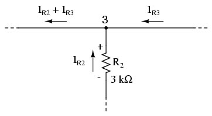

## Theory 

<strong>Kirchhoff’s Current Law:</strong> This law is also called Kirchhoff's point rule, Kirchhoff's junction rule (or nodal rule), and Kirchhoff's first rule. It states that, "In any network of conductors, the algebraic sum of currents meeting at a point (or junction) is zero".

 

<strong>Kirchhoff’s Voltage Law:</strong> This law is also called Kirchhoff's second law, Kirchhoff's loop (or mesh) rule, and Kirchhoff's second rule. It states that, "The algebraic sum of all IR drops and EMFs in any closed loop (or mesh) of a network is zero".

$$\sum_{k=1}^{n} V_k = 0$$

Here, <em>n</em> is the total number of voltages measured.

Together, Kirchhoff's Voltage and Current Law is a formidable pair of tools useful in analysing electric circuits.

<strong>Example 1:</strong> Let's take a look at an example circuit, number the points in the circuit for voltage reference:

 

If we were to connect a voltmeter between points 2 and 1, red test lead to point 2 and black test lead to point 1, the meter would register +45 volts. Typically the "+" sign is not shown, but rather implied for positive readings in digital meter displays. However, for this lesson the polarity of the voltage reading is very important and so positive numbers are shown explicitly:

$$E_{2\text{-}1} = +45\mathrm{V}$$

  When a voltage is specified with a double subscript (the characters <code>2-1</code> in the notation <code>E2-1</code>), it means the voltage at the first point (2) as measured in reference to the second point (1). A voltage specified as <code>Ecg</code> would mean the voltage as indicated by a digital meter with the red test lead on point "c" and the black test lead on point "g": the voltage at "c" in reference to "g".

  If we were to take that same voltmeter and measure the voltage drop across each resistor, stepping around the circuit in a clockwise direction with the red test lead of our meter on the point ahead and the black test lead on the point behind, we would obtain the following readings:

$$E_{3\text{-}2} = -10\mathrm{V}$$
$$E_{4\text{-}3} = -20\mathrm{V}$$
$$E_{1\text{-}4} = -15\mathrm{V}$$

 

  We should already be familiar with the general principle for series circuits stating that individual voltage drops add up to the total applied voltage, but measuring voltage drops in this manner and paying attention to the polarity (mathematical sign) of the readings reveals another facet of this principle; that the voltages measured as such all add up to zero:

 

  This principle is known as <strong>Kirchhoff's Voltage Law</strong> (discovered in 1847 by Gustav R. Kirchhoff, a German physicist), and it can be stated as such:

<blockquote>
  "The algebraic sum of all voltages in a loop must equal zero."
</blockquote>

  By algebraic, it means accounting for signs (polarities) as well as magnitudes. By loop, it means any path traced from one point in a circuit around to other points in that circuit, and finally back to the initial point. In the above example the loop was formed by following the points in this order: <code>1-2-3-4-1</code>. It doesn't matter which point we start at or which direction we proceed in tracing the loop; the voltage sum will still equal zero. To demonstrate, we can tally up the voltages in loop <code>3-2-1-4-3</code> of the same circuit:

 

  This can be easily verified using the simulator to create the above mentioned circuit and measuring the voltages across the resistances using the voltmeter, in a clockwise direction.

<strong>Example 2:-</strong>

  Let's take a closer look at that last parallel example circuit:

Solving the values of voltage and current in this circuit: 

 

  At this point, we know the value of each branch current and the total current in the circuit. We know that the total current in a parallel circuit must equal the sum of the branch currents, but there's more going on in this circuit than just that. Taking a look at the currents at each wire junction point (node) in the circuit, we should be able to see something else:

 

  At each node on the negative "rail" (wire <code>8-7-6-5</code>) we have current splitting off the main flow to each successive branch resistor. At each node on the positive "rail" (wire <code>1-2-3-4</code>) we have current merging together to form the main flow from each successive branch resistor. This fact should be fairly obvious if you think of the water pipe circuit analogy with every branch node acting as a "tee" fitting, the water flow splitting or merging with the main piping as it travels from the output of the water pump toward the return reservoir or sump.

  If we were to take a closer look at one particular "tee" node, such as node 3, we see that the current entering the node is equal in magnitude to the current exiting the node:

 

  From the right and from the bottom, we have two currents entering the wire connection labelled as node 3. To the left, we have a single current exiting the node equal in magnitude to the sum of the two currents entering. To refer to the plumbing analogy: so long as there are no leaks in the piping, the flow that enters the fitting must also exit the fitting. This holds true for any node ("fitting") no matter how many flows enter or exit. Mathematically, we can express this general relationship as:

$$I_{exiting}=I_{entering}$$

  Mr. Kirchhoff decided to express it in a slightly different form (though mathematically equivalent), calling it <strong>Kirchhoff's Current Law (KCL)</strong>:

$$I_{exiting}+(-I_{entering})=0$$

  Summarised in a phrase, Kirchhoff's Current Law reads as such:

<blockquote>
  "The algebraic sum of all currents entering and exiting a node must equal zero."
</blockquote>

  That is, if we assign a mathematical sign (polarity) to each current denoting whether they enter (+) or exit (-) a node, we can add them together to arrive at a total of zero, which is guaranteed.

  Taking our example node (number 3), we can determine the magnitude of the current exiting from the left by setting up a KCL equation with that current as the unknown value:

$$I_2 + I_3 + I = 0$$
$$2\mathrm{mA} + 3\mathrm{mA} + I = 0$$
$$\text{solving for } I \text{ ...}$$
$$I = -2\mathrm{mA} - 3\mathrm{mA}$$
$$I = -5\mathrm{mA}$$

  The negative (-) sign on the value of 5 milliamps tells us that the current is exiting the node, as opposed to the 2 milliamp and 3 milliamp currents, which were both positive (and therefore entering the node). Whether negative or positive denotes current entering or exiting is entirely arbitrary, so long as they are opposite signs for opposite directions and we stay consistent in our notation, KCL will work.

## Verifying Kirchhoff’s Current Law using the simulator:

 

